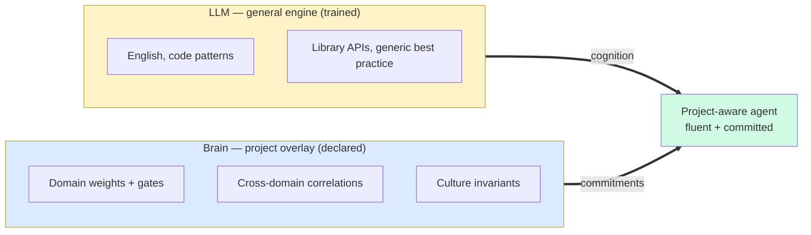
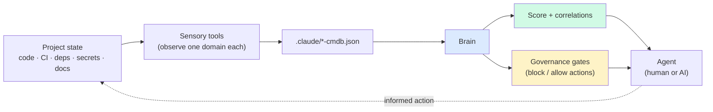

# NeuroGrim — Elevator Pitch

**Version:** 1.1 — 2026-04-27
**Read time:** about a minute.
**Audience:** anyone hearing about NeuroGrim for the first time.

---

## The problem

AI agents can write code, refactor modules, propose architecture changes. But they're
project-blind. They don't know your CI hasn't run in three weeks, your test coverage
dropped 12% since last sprint, or that someone added a dependency two days ago that
nobody has reviewed.

That knowledge isn't in the source files. It's spread across CI runs, lockfiles, audit
logs, and the conventions your team has accumulated over years. Humans pick it up;
agents start over every conversation.

## What it is

NeuroGrim gives AI agents project-specific awareness they can't get from training.
Concretely: **a declared overlay of project-shaped commitments on a general-purpose
statistical engine** — the LLM provides cognition; the Brain provides what to be
cognizant of.

A good prompt teaches an agent about software in general. The Brain teaches it about
**your** project.



The LLM is a fluent stranger. The Brain is the project's portable self-knowledge — what
it values, what it watches, what's drifting. Together they're a colleague.

## How it works

Small sensory tools observe project state — test health, dep freshness, secret hygiene,
whatever you care about — and write JSON snapshots. The Brain reads them, weights by
confidence, looks for cross-domain correlations, and produces both a health score and
governance gates that every agent reads before acting.



A score of 78 isn't the point. The point is: which domain dropped, what correlated with
it, and what the agent should know before merging. A real Brain output looks like:

```
Overall: 78 / 100  (was 81 yesterday)

  Test health          92  stable
  Security             71  declining  ← unpatched advisory
  Docs coverage        64  stable

  Correlation: security + docs drift in same week three times.
               Suggests docs tooling out of date with current deps.
```

## What you get

- **Agents arrive informed.** Every agent that opens your project starts with the
  current health picture, not by re-reading the source tree from scratch.
- **Drift surfaces early.** Cross-domain correlations name compound risks (security
  drop *plus* dep churn → audit your patches) that single-metric dashboards miss.
- **Governance is declarative.** Block risky actions in JSON, not by exception or
  tribal memory.
- **Scales without rewrite.** Project Brain inside ecosystem Brain inside meta-Brain
  — same protocol at every level.

## See it work

- **20-minute walkthrough:** [docs/getting-started.md](docs/getting-started.md) —
  clone to first score, with a working example.
- **Methodology:** [LSP-Brains/INTRO.md](https://github.com/KeenanHoffman/LSP-Brains/blob/main/INTRO.md)
  — problem-first introduction to the pattern.
- **Architecture:** [whitepaper/WHITEPAPER.md](whitepaper/WHITEPAPER.md) — long-form
  walkthrough with full architecture and rationale.

---

*This pitch is a maintained document. Bump the version above when the framing or
diagrams substantively change; minor edits (typo, link fix, single-word tweak) don't
require a bump.*
