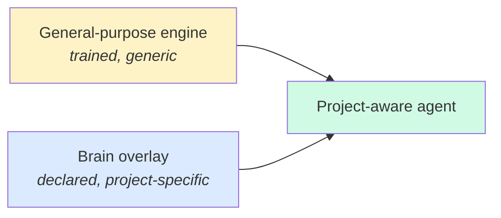
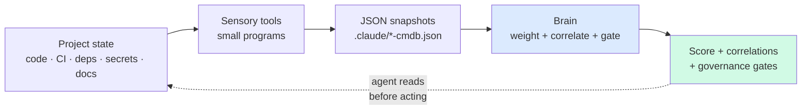

# NeuroGrim — what it does in 60 seconds

**Version:** 1.0 — 2026-04-27
**Read time:** ~60 seconds.
**Audience:** anyone hearing about NeuroGrim for the first time.

---

## The problem

AI agents can write code, refactor modules, propose architecture changes. But they're
project-blind. They don't know your tests have been quietly asserting nothing for six
months, that the dep you pinned "for one release" is eighteen months stale, or that the
secret rotated out of the codebase still lives in git history.

That knowledge isn't in the source files. It's spread across CI, lockfiles, audit logs,
and the conventions your team has accumulated over years. Humans pick it up; agents
start over every conversation.

## What it is

NeuroGrim is **a declared overlay of project-shaped commitments on a general-purpose
statistical engine.** The LLM provides cognition; the Brain provides what to be
cognizant of.

The LLM is a fluent stranger. The Brain is the project's portable self-knowledge — what
it values, what it watches, what's drifting. Together they're a colleague.

## How it works

Small sensory tools observe project state — test health, dep freshness, secret hygiene,
whatever you care about — and write JSON snapshots. The Brain reads them, weights by
confidence, looks for cross-domain correlations, and gives every agent a unified picture
before it acts.

A score of 78/100 isn't the point. The point is: which domain dropped, what correlated
with it, and what the agent should know before merging.

## What you get

- **Honest scoring.** Unknown is not good — confidence weights matter.
- **Declarative.** Domain weights, gates, governance live in a JSON registry. Editable,
  reviewable, diffable.
- **Language-agnostic.** The project being watched can be in any language; sensors are
  small programs that read whatever you point them at.
- **Composable.** Brains stack — project Brain inside ecosystem Brain inside meta-Brain.

## See it work

- **20-minute walkthrough:** [docs/getting-started.md](docs/getting-started.md) —
  clone to first score, with a working example.
- **Methodology:** [LSP-Brains/INTRO.md](https://github.com/KeenanHoffman/LSP-Brains/blob/main/INTRO.md)
  — problem-first introduction to the pattern.
- **Architecture:** [whitepaper/WHITEPAPER.md](whitepaper/WHITEPAPER.md) — long-form
  walkthrough with full architecture and rationale.

---

*This pitch is a maintained document. Bump the version above when the framing or
diagrams substantively change; minor edits don't require a bump.*
